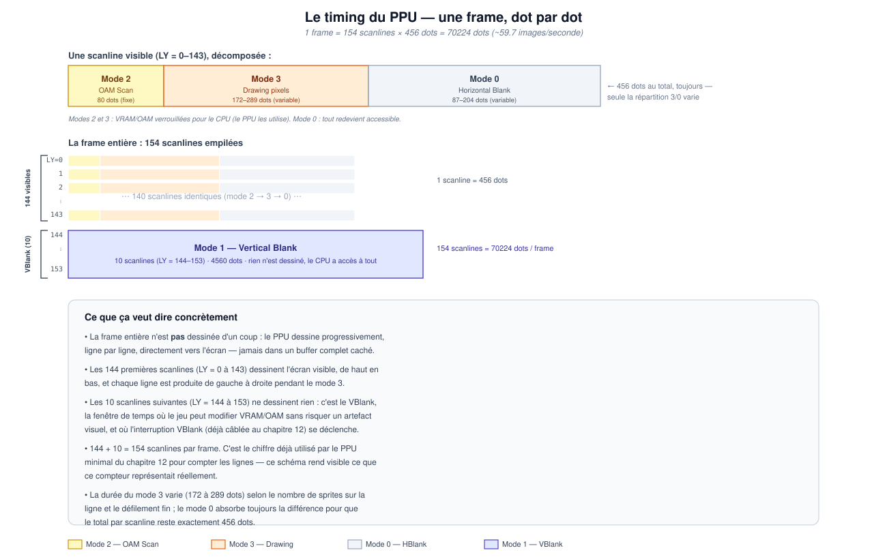

# 28. Le balayage ligne par ligne : comment une frame est réellement dessinée

Avant d'écrire la moindre ligne de code pour un vrai rendu, il faut une
image mentale correcte de *comment* le PPU produit une image — parce que
l'erreur la plus commune en construisant un PPU est d'imaginer qu'il
prépare une image complète quelque part en mémoire puis l'envoie d'un
coup à l'écran. Ce n'est pas du tout ainsi que le vrai matériel (hardware)
fonctionne.

## La frame entière n'est pas dessinée d'un coup

Le PPU dessine **progressivement, ligne par ligne, directement à
l'écran**. Il n'existe pas de « buffer d'image complet » caché dans
lequel le PPU peindrait toute l'image avant de l'afficher — chaque
ligne horizontale de pixels est calculée puis émise, une par une, dans
l'ordre, pendant que l'écran physique balaie littéralement ce pixel à
ce moment précis.

Une frame complète correspond à **154 scanlines** :

- Les **144 premières** (`LY` de 0 à 143) dessinent l'écran visible, de
  haut en bas. Chacune de ces lignes est elle-même produite de gauche à
  droite, pixel par pixel.
- Les **10 suivantes** (`LY` de 144 à 153) ne dessinent rien du tout :
  c'est le VBlank, la fenêtre de temps pendant laquelle le jeu peut
  modifier la VRAM/l'OAM sans risquer un artefact visuel à l'écran, et
  pendant laquelle l'interruption VBlank (déjà câblée au chapitre 12) se
  déclenche.

Ce chiffre de 154 n'est pas nouveau : c'est exactement celui que le PPU
minimal du chapitre 12 utilise déjà pour faire tourner son compteur de
lignes. Ce qui change ici, c'est de comprendre *ce que ce compteur
représente réellement* — une position de balayage physique, pas un
simple numéro de ligne arbitraire.

## Les quatre modes, et pourquoi leur durée varie

Chaque scanline visible traverse trois modes dans l'ordre, pour un total
fixe de 456 *dots* (l'unité de temps la plus fine du PPU, un multiple du
cycle du CPU) :

- **Mode 2 — OAM Scan** (80 dots, toujours) : le PPU recherche dans
  l'OAM quels sprites apparaissent sur cette ligne.
- **Mode 3 — Drawing** (172 à 289 dots, variable) : les pixels sont
  réellement calculés et émis, un par un.
- **Mode 0 — Horizontal Blank** (87 à 204 dots, variable) : le temps
  mort qui absorbe la différence, pour que le total reste toujours
  exactement 456 dots.

Pendant les modes 2 et 3, la VRAM et l'OAM sont verrouillées du point de
vue du CPU (le PPU les utilise activement) ; pendant le mode 0, tout
redevient accessible. La durée du mode 3 varie selon le nombre de
sprites présents sur la ligne et certains détails de défilement fin —
c'est une des sources classiques de bugs de timing subtils dans un
émulateur, et une raison supplémentaire de comprendre ce schéma avant de
l'implémenter.

Après les 144 lignes visibles vient le Mode 1 (Vertical Blank), qui dure
10 scanlines complètes (4560 dots) d'un coup, sans sous-découpage en
modes 2/3/0.

## Ce qui vient ensuite

Ce chapitre ne modifie aucun code — c'est une base conceptuelle. Le
chapitre 29 couvre la seconde moitié du problème (que représente
visuellement un pixel, une fois que le PPU sait *quand* le produire), et
le guide [PPU — Background Rendering Guide](../ppu-background.md)
détaille la machine à états complète (le pixel FIFO et le fetcher) qui
met tout cela en œuvre dot par dot.
