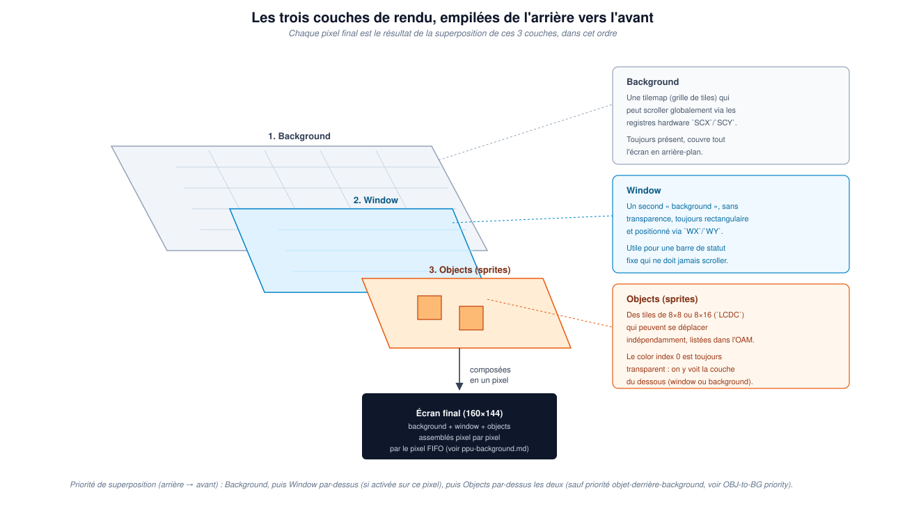

# 29. Les trois couches de rendu : background, window et objects

Le chapitre 28 a établi *quand* le PPU produit chaque pixel. Avant de
construire le mécanisme qui le fait réellement (le pixel FIFO et le
fetcher, couverts en détail dans le guide associé), il faut comprendre
*ce qui* compose ce pixel. La réponse : jusqu'à trois couches distinctes,
superposées.

## Trois couches, de l'arrière vers l'avant

La Game Boy a trois couches, empilées dans cet ordre précis — chacune
peut cacher celle qui se trouve derrière elle :

- **Background** : une tilemap (grille de tiles) qui peut scroller
  globalement via des registres hardware (`SCX`/`SCY`). Elle est
  toujours présente et couvre tout l'écran en arrière-plan.
- **Window** : un second « background » par-dessus, sans transparence,
  toujours rectangulaire, positionné via `WX`/`WY`. Utile pour une barre
  de statut fixe qui ne doit jamais scroller avec le reste de la scène.
- **Objects (sprites)** : des tiles de 8×8 ou 8×16 (contrôlé par
  `LCDC`) qui peuvent se déplacer indépendamment du quadrillage de la
  tilemap, listés dans l'OAM. Le color index 0 y est toujours
  transparent : à cet endroit précis, on voit la couche du dessous
  (window ou background) au travers.

## Pourquoi cet ordre compte

Chaque pixel final affiché à l'écran est le résultat de cette
superposition, évaluée dans l'ordre : le background est toujours là en
dessous de tout ; la window, quand elle est activée et que le pixel
courant tombe dans sa zone, le remplace entièrement (pas de mélange,
pas de transparence) ; les objects, enfin, se dessinent par-dessus les
deux — sauf pour leurs pixels de color index 0, qui restent transparents
et laissent voir ce qu'il y a dessous, et sauf le cas particulier de la
priorité objet-derrière-background (un bit par objet qui peut inverser
cette règle pour un sprite donné).

C'est précisément parce que ces trois couches ne sont *pas* indépendantes
— elles doivent être combinées pixel par pixel, au bon moment, dans le
bon ordre — que le vrai mécanisme du PPU ne peut pas se contenter de
dessiner trois images séparées puis les fusionner après coup. Il les
construit toutes les trois en même temps, dot par dot, pendant le mode 3
d'une seule scanline.

## Ce qui vient ensuite

Ce chapitre, comme le précédent, pose les bases conceptuelles sans
modifier le code. Le guide
[PPU — Background Rendering Guide](../ppu-background.md) construit déjà
intégralement la couche background avec le véritable mécanisme de pixel
FIFO et de fetcher ; la window et les objects, une fois ce fondement en
place, s'ajoutent par-dessus sans réécriture — exactement comme annoncé
au chapitre 27.
